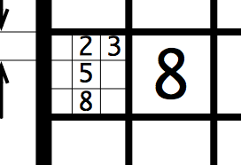

# Sudoku

An iOS app that allows the user to fill in Sudoku puzzles. The puzzle is created with a custom view that uses Core Graphics for rendering and responds to “finger taps.” Uses a hierarchy of views with layouts tailored for both portrait and landscape device orientations.

## Authors / Contact

**[Spencer Kitchen](mailto:spencer.kitchen@wsu.edu)**

Student ID: 11480841

## Description

Sudoku lets you solve sudoku problems!

### Features include

* **Universal Layout** - Layout will adapt to the device the player is using

    
    

* **Pencil Mode** - Lets the player track guesses for the square

    

## How to build and run

Explain to build and run the target program(s).

As of now, app must be ran through iOS simulator provided through xcode.

1. Clone tenKey repo from : `git@gitlab.encs.vancouver.wsu.edu:ssmiler/Sudoku.git`

1. Open in Xcode by double clicking: `Sudoku.xcodeproj`

1. Select preferred targeted iOS emulator by the drop down menu on the top of the screen by the run button.

1. Click the run button to launch app on iOS emulator. (Looks like a play button on top of screen)

## Archive

```txt
Sudoku
  ├── Sudoku
  │      ├── SudokuPuzzle.swift         : Contains model of Sudoku puzzle
  │      ├── ViewController.swift       : View Controller
  │      ├── PuzzleView.swift           : View controller for puzzle view
  │      ├── buttonExtention.swift      : Adds features to buttons in IB
  │      ├── hard.plist                 : Holds hard sudoku puzzles
  │      ├── simple.plist               : Holds easy Sudoku puzzles
  │      ├── sudokuAppTitle.png         : splash screen text
  │      └── Assets.xcassets            : Holds app icons
  │          └── AppIcon.appiconset
  │              ├── Contents.json
  │              ├── Icon-App-20x20@1x.png
  │              ├── Icon-App-20x20@2x-1.png
  │              ├── Icon-App-20x20@2x.png
  │              ├── Icon-App-20x20@3x.png
  │              ├── Icon-App-29x29@1x.png
  │              ├── Icon-App-29x29@2x-1.png
  │              ├── Icon-App-29x29@2x.png
  │              ├── Icon-App-29x29@3x.png
  │              ├── Icon-App-40x40@1x.png
  │              ├── Icon-App-40x40@2x-1.png
  │              ├── Icon-App-40x40@2x.png
  │              ├── Icon-App-40x40@3x.png
  │              ├── Icon-App-60x60@2x.png
  │              ├── Icon-App-60x60@3x.png
  │              ├── Icon-App-76x76@1x.png
  │              ├── Icon-App-76x76@2x.png
  │              └── Icon-App-83.5x83.5@2x.png
  │
  ├── README.md                         : ReadMe for sudoku project
  └── rsc                               : ReadMe resources

```

## Assets
* Puzzle Icon From: http://icons.iconarchive.com/icons/alecive/flatwoken/512/Apps-Sudoku-icon.png
* Icons created with: https://makeappicon.com